## 🛠️ Project: Automated HR Data Governance Pipeline
**Role:** Product Owner & Developer | **Stack:** Python, Pandas, Chaos Engineering

> **The Business Challenge:** HRIS migrations often fail due to "dirty data"—human errors like typos, negative ages, or impossible tenure. Manual auditing of 1,000+ rows is slow and error-prone.
>
> **The Solution:** I built an automated "Governance Engine" that acts as a firewall for HR data. It creates a trusted data layer for People Analytics.


### 🏗️ Architecture: The "Chaos & Order" Approach
I didn't just write a cleaning script. I implemented **Test-Driven Development** by building a "Chaos Monkey" that intentionally corrupts data to prove the Audit Engine works.

```mermaid
graph LR
    A[Raw HRIS Data] -->|Ingest| B(🛑 Module 1: Chaos Monkey)
    B -->|Injects Logic Errors| C{⚙️ Module 2: Audit Engine}
    C -->|Pass| D[✅ Clean Data Warehouse]
    C -->|Fail| E[⚠️ Quarantine Log]
    E -->|Analyze| F[📄 Executive Health Scorecard]
```



### 🚀 Key Features

*   **Chaos Monkey Simulation**: Intentionally injects 5% errors (Typos, Logic, Compliance) to stress-test the system.
*   **Governance Engine**: Strictly validates business logic (e.g., Department names, Age limits, Tenure consistency).
*   **Executive Reporting**: Automatically generates a "Data Health Score" and actionable summary (e.g., "Urgent Cleanup Needed").

### 💻 How to Run

```bash
python data-lab/05-data-quality-audit/hr_pipeline.py
```
