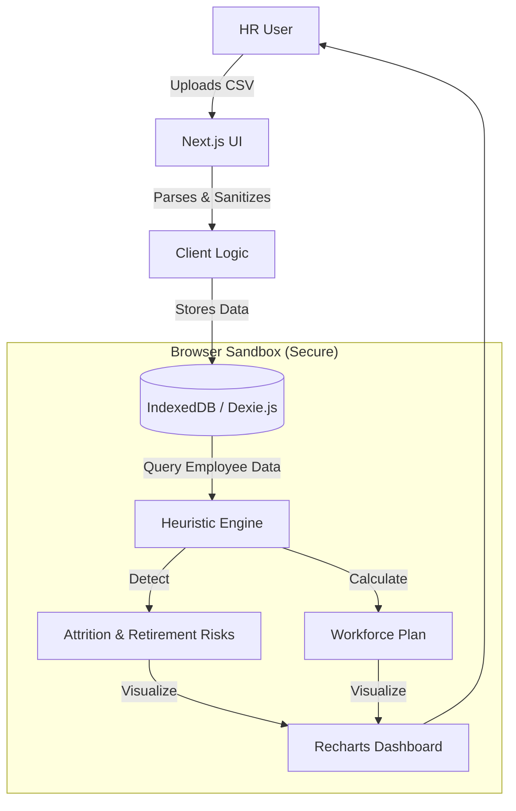

## What It Does
**HR Analytics 2030** is a secure, local-first dashboard that transforms raw HRIS data into actionable workforce intelligence. Unlike traditional BI tools that require cloud uploads, this application runs entirely in your browser using **IndexedDB** and **Client-Side Logic**, ensuring sensitive employee data never leaves your device.

[🚀 **Launch Live Dashboard**](/projects/hr-analytics-dashboard/)

## The Problem It Solves
HR teams often struggle with:
1.  **Data Privacy**: Hesitancy to upload sensitive payroll/attrition data to public cloud tools or external SaaS vendors.
2.  **Static Reporting**: Relying on backward-looking Excel sheets instead of forward-looking scenarios.
3.  **Complex Modeling**: Lack of accessible tools to model "what-if" scenarios for attrition and retirement without a data science team.

## Architecture & How It Works
The application uses a **Local-First Architecture**. The browser is the database.

## Key Features

### 🔒 Privacy-First Design
Zero data exfiltration. The application uses `IndexedDB` to persist data strictly within your browser profile. You can upload a 10,000-row CSV, close the tab, come back later, and your data is still there—but it never touched a server.

### 🔮 Predictive Attrition Modeling
The system runs a heuristic analysis on every employee to flag **High Flight Risks** based on:
*   **Tenure Cliff**: Detecting employees in the critical 2-4 year turnover window.
*   **Compa-Ratio**: Identifying high performers (Rating 4-5) with below-market salaries.
*   **Retirement Risk**: Flagging key roles approaching retirement age.

### 📈 Interactive Scenario Planning
Stop guessing. The "Plan" module allows leaders to toggle a single "Growth Target" slider (e.g., +15% YoY) and immediately see:
*   How many new hires are needed per department.
*   The gap between current headcount, attrition, and future targets.

## Tech Stack
| Layer | Technology |
|---|---|
| **Framework** | Next.js 15 (App Router, Static Export) |
| **Language** | TypeScript |
| **Database** | Dexie.js (IndexedDB Wrapper) |
| **Styling** | Tailwind CSS v4 |
| **Visualization** | Recharts |
| **Parsing** | PapaParse (Stream-capable CSV parsing) |

[View Source Code](https://github.com/0xthijs/hr-analytics-2030)
