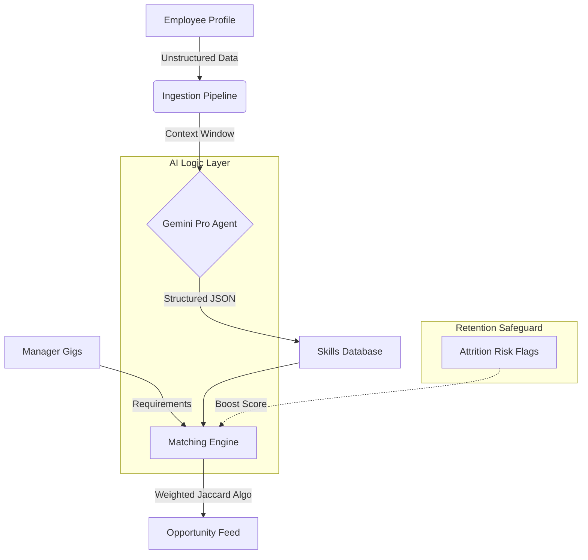

## What It Does
SkillFlex is an AI-driven internal talent marketplace that automatically matches employees to short-term projects ("gigs") based on their inferred skills. It replaces static, manual skill profiles with dynamic, AI-generated talent signals to uncover hidden potential within the workforce.

## The Problem It Solves
High-performing employees often leave diverse organizations because they cannot find internal growth opportunities, while managers struggle to find talent for short-term needs. Traditional HR systems rely on manual data entry, resulting in outdated skills inventories that fail to capture an employee's true capabilities or flight risk.

## How It Works
The system uses a **Google Gemini Pro** agent to ingest unstructured data (resumes, project history, Slack/Teams activity) and infer a "Live Skills" profile for each employee. It then uses a retention-weighted algorithm to match these profiles against open internal gigs, prioritizing matches that reduce attrition risk for high-value talent.

## Key Features
- **AI Skill Inference**: Automatically extracts 5 hard and 3 soft skills from unstructured text using LLMs, removing the need for manual profile updates.
- **Retention-Weighted Matching**: The matching engine applies a 1.2x score multiplier to employees flagged as "High Flight Risk," surfacing opportunities to retain them.
- **Premium SaaS Experience**: A fully responsive, dark-mode enabled UI (built with Flask & Tailwind) that provides a consumer-grade experience for enterprise users.
- **Explainable AI**: Every gig recommendation includes a "Why this matches you" section to build user trust in the AI suggestions.

## Results / Impact
This Proof of Concept demonstrates how Generative AI can transform internal mobility from a passive database into an active retention engine. By inferring skills rather than asking for them, SkillFlex reduces the friction of profile creation to zero, promoting higher adoption rates than traditional manual systems.

## Tech Stack
| Layer | Technology |
|---|---|
| Frontend | Flask (Jinja2) / TailwindCSS / Alpine.js |
| Backend | Python / Flask |
| AI Engine | Google Gemini Pro |
| Data | SQLAlchemy / SQLite (PoC) |
| Deployment | Localhost (Demo) |

[View Code](https://github.com/0xthijs/hr-ai-portfolio/tree/main/apps/skillflex)
