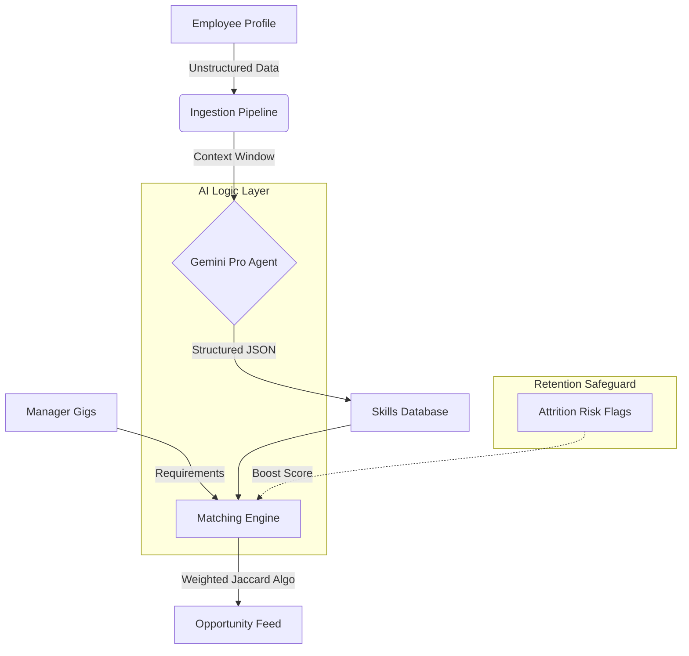

## 💼 Executive Summary
**The Problem:** High-performing employees often leave because they cannot find internal growth opportunities. Traditional HR systems (LMS/HRIS) rely on static, outdated skills data.

**The Solution:** SkillFlex is an AI-native "Internal Mobility Engine" that creates a dynamic marketplace for talent. It uses **Google Gemini Pro** to infer "Live Skills" from unstructured data and matches employees to gigs based on a **Retention-Weighted Algorithm**.

---

## 🏗️ System Architecture
*Visualizing the data flow from Unstructured Input to Strategic Match.*



## 📺 Product Capabilities

### 1. The "Retention-First" Marketplace
SkillFlex doesn't just match keywords; it prioritizes business continuity.

**Live Demo:**


[INSERT YOUR LOOM/VIDEO LINK HERE]

### 2. Core Modules

| Module | Function | Tech Stack |
| :--- | :--- | :--- |
| **Talent Ingestion** | Infers 5 Hard + 3 Soft skills from unstructured role/bio data. | `Google Gemini Pro` |
| **Matching Engine** | Calculates `Jaccard Similarity` + `Flight Risk Boost` (1.2x multiplier). | `Python` / `Pandas` |
| **Manager Dashboard** | Visualizes "At Risk" talent and distribution. | `Flask` / `Tailwind` |
| **Employee Portal** | Personalized gig feed with "Why this matches you" explainability. | `Jinja2` / `Alpine.js` |

---

## 🛠️ Technical Implementation

### Prerequisites
*   Python 3.10+
*   Google Gemini API Key

### Quick Start
```bash
# 1. Install Dependencies
pip install -r requirements.txt

# 2. Configure Environment
# Create .env and add: GOOGLE_API_KEY=your_key

# 3. Run Ingestion (ETL)
# (Optional: uses Gemini to re-infer skills from raw data)
python ingestion.py

# 4. Launch Application
python app.py
```

## 📈 RoI & Future Roadmap
*   **Q3 2026**: Integration with Workday/BambooHR APIs.
*   **Q4 2026**: "Bias Detective" Module to scan gig descriptions for exclusionary language.
